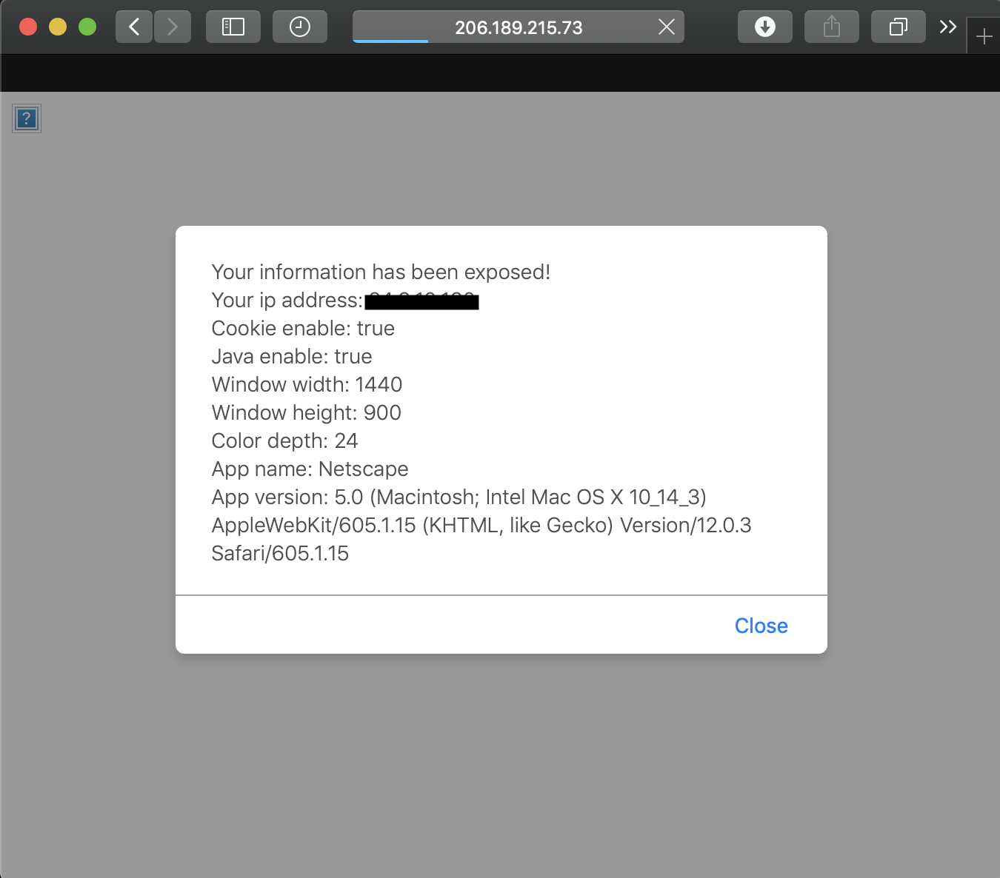

# Polyglot File

\[[link](http://206.189.215.73:9999)\]

A Polyglot File is a file that contains multiple formats and/or contents. For example, a jpeg file could also be a java file, a flash video, and a pdf file in the same time! When you download a file from internet, you could've potentially downloaded a malicious code as well.


## Compiling a JavaScript/GIF File

```shell
brew install yasm
yasm gifjs.asm -o img.gif
mv img.gif server/img.gif
```

## Host the Website

The website will run on port 9999 unless you change it in server.py.

```shell
cd server/
python server.py
```

## JavaScript Part

The last line of gifjs.asm file is where you can insert javascript code.

## Result



## Author

Brian Sung

## Disclaimer

This repository is for academic purposes, the use of this software is your responsibility.

## References

0. [PoC||GTFO - Alex Omar](http://docs.alexomar.com/biblioteca/pocorgtfobible.pdf)
1. [Funky File Formats](https://www.youtube.com/watch?v=hdCs6bPM4is)
1. [Bypassing Content Security Policy with a JS/GIF Polyglot](https://ajinabraham.com/blog/bypassing-content-security-policy-with-a-jsgif-polyglot)
